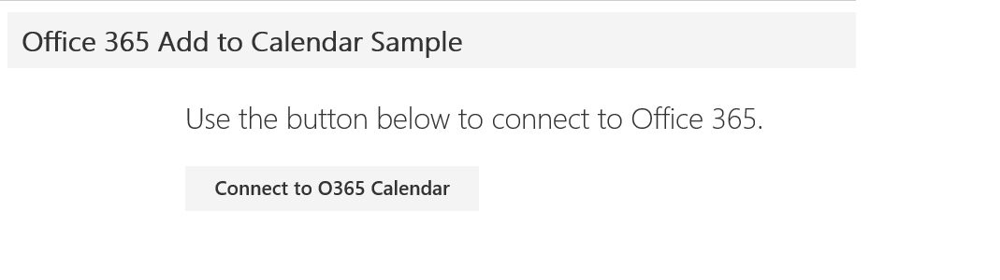
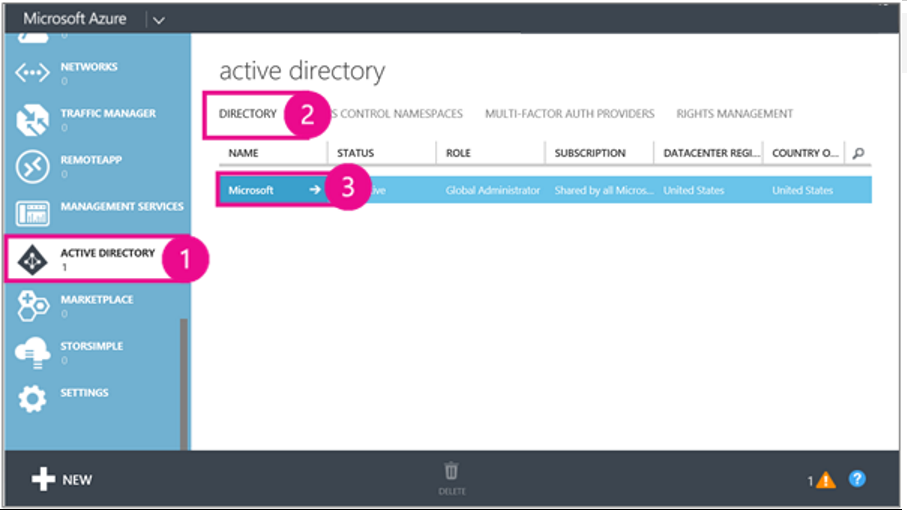
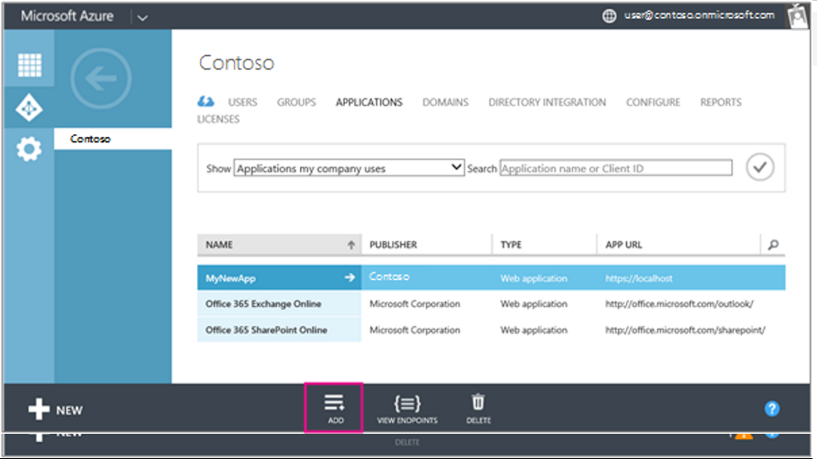
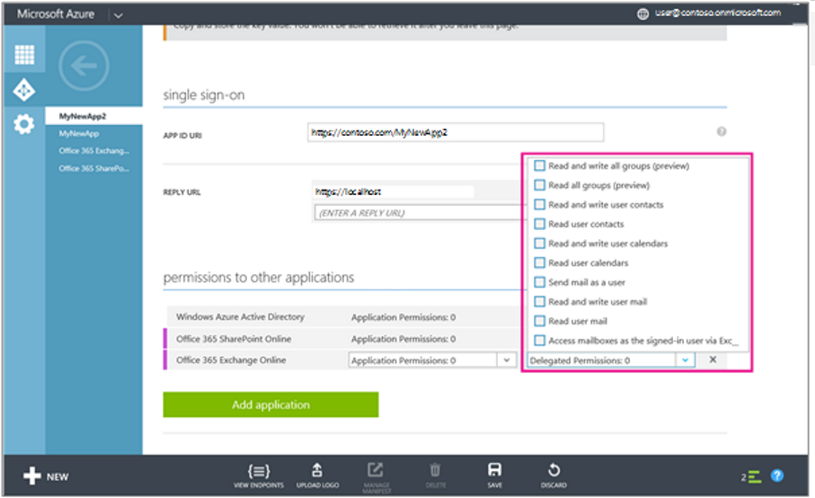
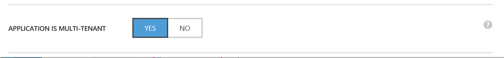
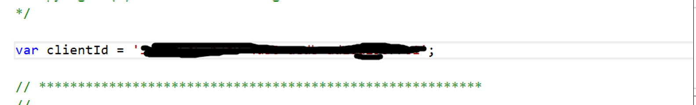

# Office 365 Add to Calendar sample using Microsoft Graph

Connecting to Office 365 is the first step every app must take to start working with Office 365 services and data. This sample shows how to connect and then call the Microsoft Graph API (previously called Office 365 unified API), and uses the Office Fabric UI to create an Office 365 experience.

> Note: Try out the [Get started with Office 365 APIs](http://dev.office.com/getting-started/office365apis?platform=option-angular#setup) page which simplifies registration so you can get this sample running faster.



## Prerequisites

To use the Office 365 Angular Connect sample, you need the following:
* [Node.js](https://nodejs.org/). Node is required to run the sample on a development server and to install dependencies. 
* An Office 365 account. You can sign up for [an Office 365 Developer subscription](https://portal.office.com/Signup/Signup.aspx?OfferId=6881A1CB-F4EB-4db3-9F18-388898DAF510&DL=DEVELOPERPACK&ali=1#0) that includes the resources that you need to start building Office 365 apps.

     > Note: If you already have a subscription, the previous link sends you to a page with the message *Sorry, you can’t add that to your current account*. In that case use an account from your current Office 365 subscription.
* A Microsoft Azure tenant to register your application. Azure Active Directory (AD) provides identity services that applications use for authentication and authorization. A trial subscription can be acquired here: [Microsoft Azure](https://account.windowsazure.com/SignUp).

     > Important: You also need to make sure your Azure subscription is bound to your Office 365 tenant. To do this, see the Active Directory team's blog post, [Creating and Managing Multiple Windows Azure Active Directories](http://blogs.technet.com/b/ad/archive/2013/11/08/creating-and-managing-multiple-windows-azure-active-directories.aspx). The section **Adding a new directory** will explain how to do this. You can also see [Set up your Office 365 development environment](https://msdn.microsoft.com/office/office365/howto/setup-development-environment#bk_CreateAzureSubscription) and the section **Associate your Office 365 account with Azure AD to create and manage apps** for more information.
* A client ID of an application registered in Azure. This sample application must be granted the **Send mail as signed-in user** and **Send mail as signed-in user** permissions for the **Microsoft Graph** application. [Add a web application in Azure](https://msdn.microsoft.com/office/office365/HowTo/add-common-consent-manually#bk_RegisterWebApp) and [grant the proper permissions](https://github.com/OfficeDev/O365-Angular-Microsoft-Graph-Connect/wiki/Grant-permissions-to-the-Connect-application-in-Azure) to it.

     > Note: During the app registration process, make sure to specify **http://localhost:8080/** as the **Sign-on URL**.

## Configure and run the app

1. Using your favorite IDE, open **config.js** in *public/scripts*.
2. Replace *ENTER_YOUR_CLIENT_ID* with the client ID of your registered Azure application.
3. Install project dependencies with Node's package manager (npm) by running ```npm install``` in the project's root directory on the command line.
4. Start the development server by running ```node server.js``` in the project's root directory.
5. Navigate to ```http://localhost:8080/``` in your web browser.

To learn more about the sample, visit the [Angular walkthrough on graph.microsoft.io.](http://graph.microsoft.io/docs/platform/angular). 

## Register your application with Azure Active Directory
	1. Sign into the Azure Management Portal using your Office 365 Tenant Administrator credentials.
	2. Click Active Directory on the left menu, then click on the directory for your Office 365 developer site. 

	

	

	3. On the top menu, click Applications.
	4. Click Add from the bottom menu.

	

	5. On the What do you want to do page, click Add an application my organization is developing.
	6. On the Tell us about your application page, specify any name [Add2Calendar] for the application name and select NATIVE CLIENT APPLICATION [in this case you want web application] for Type.
	7. Click the arrow icon on the bottom-right corner of the page.
	8. On the Application information page, specify a Redirect URI, for this example, you can specify http://localhost:8080.   Click the checkbox in the bottom right corner of the page.
	9. Once the application has been successfully added, you will be taken to the Quick Start page for the application. From here, click Configure in the top menu.
	10. In permissions to other applications, click Add application.
	11. Click Microsoft Graph, and then click the check mark icon. 
	12. Under permissions to other applications, click the Delegated Permissions column for Microsoft Graph.  Select Have Full Access to User's Calendars
	
	These are the permissions that will be displayed to your app user when Azure prompts them to consent to your app's permission request. In general, request only the services your app actually requires, and specify the least level of permissions in each service that still enable your app to perform its functions.
	13. Select Yes for Application is Multi-Tenant.  This will allow the application to read from any Tenant in O365 if the user gives permission.
	
	14. Copy the value specified for Client ID; you will need to paste this into the config.js file in the project.  
	
	15. Click Save in the bottom menu.

## Questions and comments

We'd love to get your feedback about the Office 365 Calendar sample. You can send your questions and suggestions to us in the [Issues](https://github.com/OfficeDev/O365-Angular-Microsoft-Graph-Connect/issues) section of this repository.

Your feedback is important to us. Connect with us on [Stack Overflow](http://stackoverflow.com/questions/tagged/office365+or+microsoftgraph). Tag your questions with [MicrosoftGraph] and [office365].
  
## Additional resources

* [Office Dev Center](http://dev.office.com/)
* [Microsoft Graph API](http://graph.microsoft.io)
* [Office 365 Profile sample for Angular](https://github.com/OfficeDev/O365-Angular-Profile)
* [Office UI Fabric](http://dev.office.com/fabric)

## Copyright
Copyright (c) 2015 Microsoft. All rights reserved.
